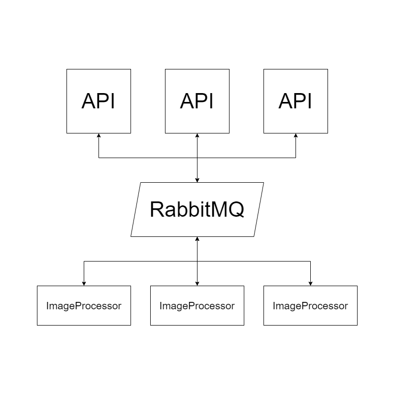
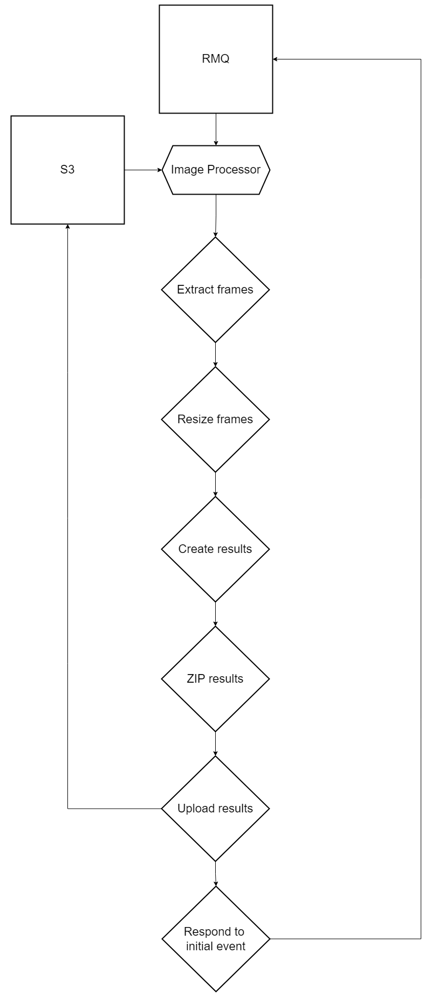

# ImageProcessor

## For building and compiling this application

You can checkout he respective READMEs

- [C++](cpp/README.md)
- [Go](go/README.md)

## Design

### External

The API Pods will send messages via RMQ in the format of a [Task](./go/internal/image_processor/task.go#L16)
The RMQ message must have the ReplyTo field set so that the image processor can know where to send the result back to.

The result payload will be in the structure of a [Result](./go/internal/image_processor/result.go#L27)

### Internal

1. We receive an event from RMQ.
2. We download the file from S3 and store it in a working dir in a tempfs.
3. We extract the frames from the file.
4. We resize the frames and correct aspect ratio.
5. We create the final outputs, avif, webp, gif + static versions.
6. We zip all the contents of the working dir (except the original upload + extracted frames)
7. We upload the results and the zip to S3.
8. We respond to the initial event from RMQ.

